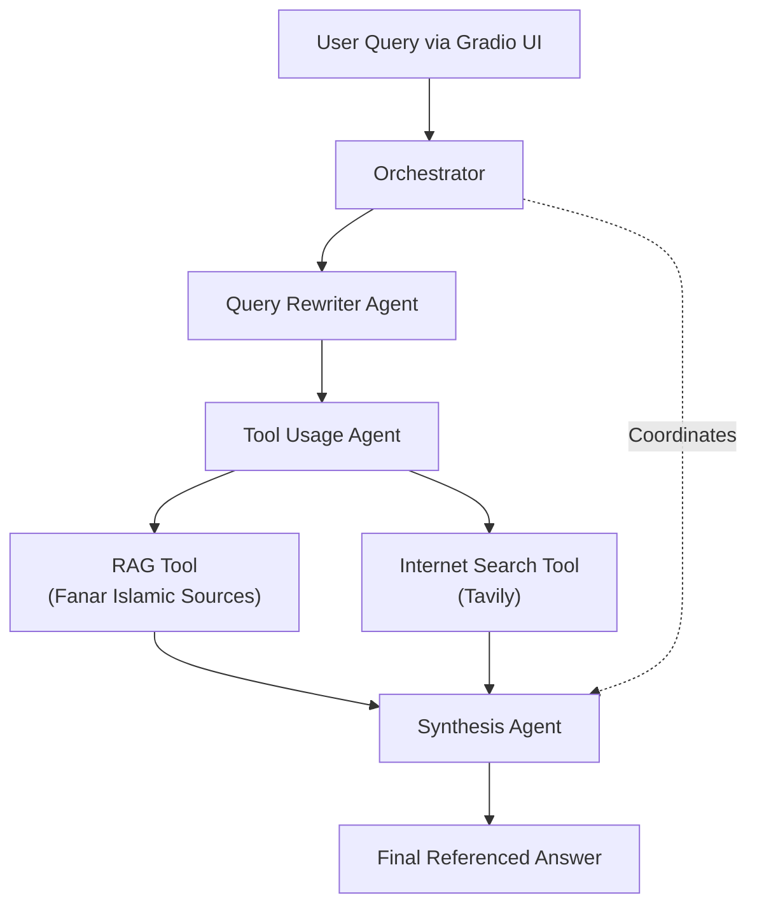

# Fanar-based Islamic Writing Copilot

## Project Description and Idea

This project is a multi-agent AI system designed to assist users with Islamic writing and knowledge retrieval. It leverages the Fanar AI model, specialized in Islamic content, combined with Tavily for web searches, to provide accurate, referenced responses grounded in reliable Islamic sources.

The core idea is to create an intelligent copilot that helps with generating Islamic-themed content, answering religious questions, and providing writing assistance while ensuring authenticity through reference to Quran, Hadith, and scholarly sources. It uses a structured multi-agent approach to process queries efficiently.

## Documentation

Detailed implementation can be found in the code files:
- **orchestrator.py**: Main coordination logic for the multi-agent system.
- **agents/**: Contains agent implementations including QueryRewriterAgent, ToolUsageAgent, and SynthesisAgent.
- **services/**: API integrations with Fanar and Tavily services.
- **prompts/**: System prompts used by agents.
- **models/schemas.py**: Data models for requests and responses.
- **Gradio_Front_End.py**: User interface implementation.
- **config/settings.py**: Configuration and environment settings.

For in-depth details, refer to the docstrings and comments in each file.

## How It Works

At a high level:
1. User submits a query via the Gradio UI.
2. The orchestrator rewrites the query for better clarity.
3. The Tool Usage Agent determines and executes appropriate tools (Islamic RAG search or web search).
4. The Synthesis Agent combines results into a comprehensive, referenced answer.

For more technical details, see `orchestrator.py` and the agents' implementations.

## Design and Overall System Overview

The system follows a multi-agent architecture:
- **Query Rewriter**: Refines user queries using Fanar AI.
- **Tool Usage Agent**: Decides on tool invocations (RAG for Islamic sources or InternetSearch via Tavily) and executes them.
- **Synthesis Agent**: Integrates tool results into a final coherent answer with references.
- **Services**: FanarService handles AI generations and RAG, TavilyService manages web searches.
- **Frontend**: Gradio-based UI for user interaction.

The system is non-conversational, processing one query at a time. It supports a "thinking mode" for more detailed reasoning (configurable).

### System Flow Diagram



This diagram illustrates the high-level flow of query processing through the multi-agent system.

## Installation and Running the Code

### Prerequisites
- Python 3.8+
- Required API keys: FANAR_API_KEY (required), TAVILY_API_KEY (optional for web search)

### Setup
1. Clone the repository:
   ```
   git clone <repository-url>
   cd Fanar_Copilot
   ```

2. Install dependencies:
   ```
   pip install -r requirements.txt
   ```

3. Set up environment variables:
   - Create a `.env` file in the `config/` folder.
   - Add your API keys:
     ```
     FANAR_API_KEY=your_fanar_api_key_here
     TAVILY_API_KEY=your_tavily_api_key_here  # Optional
     ```

### Running the Application
Run the Gradio frontend which starts the UI and backend:
```
python Gradio_Front_End.py
```

Access the UI at `http://localhost:7860` in your browser.

## Limitations
- **Non-conversational**: The backend processes single queries without maintaining conversation history.
- **Context Window**: Limited to 4096 tokens (official Fanar model limit), though internal settings cap at 2048 for generations.
- **API Dependency**: Requires Fanar API access; performance depends on external service availability and rate limits.


## Contributing
Contributions are welcome! Please fork the repository and submit pull requests. For major changes, open an issue first to discuss.

